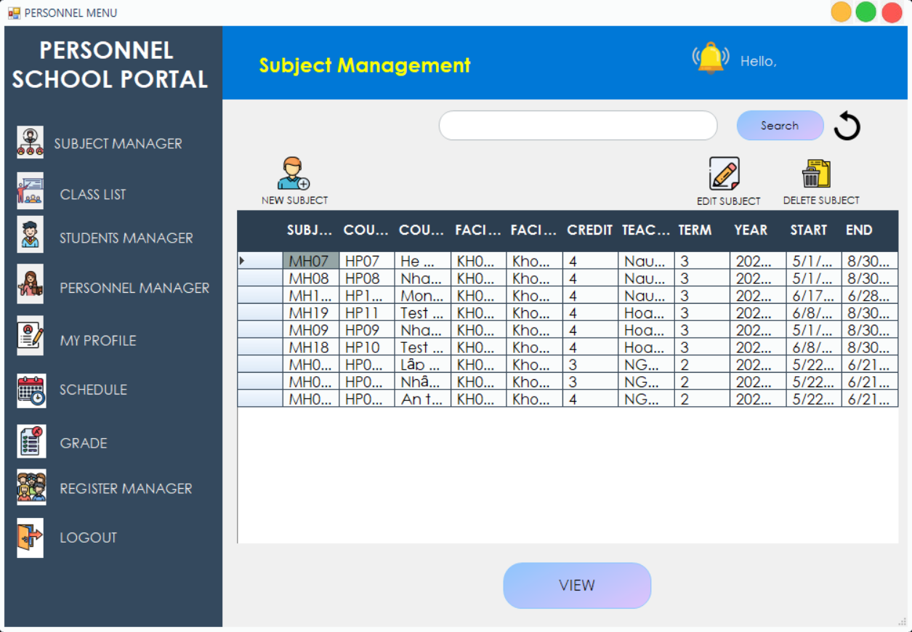
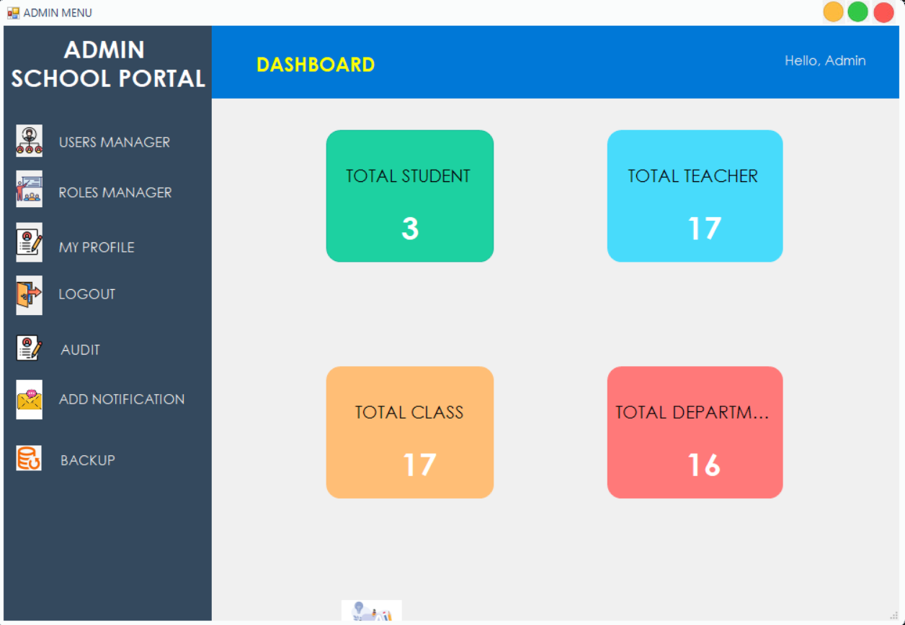
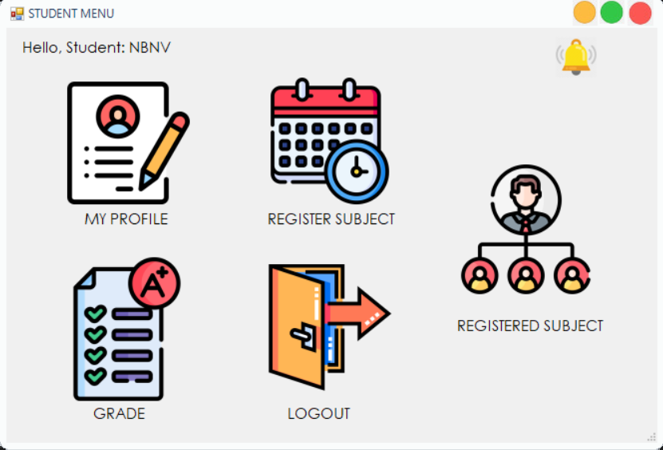

<div align="center">
  
  # 👥 Human Resource Management

_A Secure WinForms Application for Internal HR and Oracle DB Administration_ 🔐


   
   
  

</div>

## 📘 Table of Contents

1. [Introduction](#introduction) 🌟
2. [Team Members](#team-members) 🤝
3. [Technologies](#technologies) 💻
4. [Features](#features) 🔎
5. [Development](#development) 🛠️
6. [Contact](#contact) 🌐

## 🌟 <a name="introduction">Introduction</a>

**Human Resource Management** is a Windows Forms application developed for internal data management and database security in an academic environment. The system supports user-role-based access control (RBAC), Oracle Label Security (OLS), fine-grained auditing, and recovery solutions.

This project is a part of the **CSC12001 - Data Security in Information Systems** course at **University of Science – VNUHCM**. It includes two subsystems:

- Oracle DB Administration System (For DBAs)
- Internal HR Management System (For Staff, Lecturers, and Students)

The project follows a security-first design using VPD, RBAC, and OLS on Oracle DB.

## 🤝 <a name="team-members">Team Members</a>

| Name              | Student ID | Role       |
| ----------------- | ---------- | ---------- |
| Nguyễn Thanh Bình | 22120032   | Thành viên |
| Nguyễn Văn Chiến  | 22120037   | Thành viên |
| Nguyễn Văn Khánh  | 22120158   | Thành viên |
| Trần Trọng Nghĩa  | 22120231   | Thành viên |

## 💻 <a name="technologies">Technologies</a>

<div align="center">
  
  

</div>

- **C# WinForms:** For building the UI and business logic across different roles.
- **Oracle Database:** Core DBMS used to enforce RBAC, VPD, OLS, and audit policies.
- **Oracle PL/SQL:** To implement triggers, functions, and fine-grained access control.
- **Audit & Recovery:** Using Oracle Standard and Unified Audit along with log-based recovery.

## 🔎 <a name="features">Features</a>

### 🛡️ Oracle DB Admin System

- Create/Edit/Delete Users and Roles.
- Grant/Revoke privileges with `WITH GRANT OPTION`.
- Assign privileges on specific DB objects (tables, views, procedures).
- View privilege matrix per user/role.
- Apply column-level permission (SELECT/UPDATE).

### 📋 Internal HR System

- **Role: Employee (NVCB)**

  - View and edit their own phone number.

- **Role: Unit Head (TRGĐV)**

  - View employees in their unit (excluding salary info).

- **Role: Admin (NV TCHC)**

  - Full CRUD on employees.

- **Role: Lecturer (GV)**

  - View class assignments and student data of their department.

- **Role: Academic Office (NV PĐT)**

  - Manage course offerings (MOMON), update student status.

- **Role: Exam Dept (NV PKT)**

  - Update student scores after teacher approval.

- **Role: Student (SV)**
  - View and edit their own contact/address.
  - Register/unregister classes within 14 days of the semester.

### 📢 Notification System (OLS)

- Label-based message distribution by role, unit, and location.
- OLS labels for: Trưởng đơn vị, Nhân viên, Sinh viên.
- Domains: Toán, Lý, Hóa, Hành chính.

### 📜 Audit Logs

- Track unauthorized updates/view attempts on restricted fields.
- Monitor student score editing and role-inconsistent actions.
- Log and review audit trails using Fine-Grained/Unified Audit.

### 🔄 Backup & Recovery

- Manual and automatic Oracle DB backup.
- Restore operations based on system audit logs.

## 🛠️ <a name="development">Development</a>

### Prerequisites

- [Oracle Database 19c+](https://www.oracle.com/database/)
- [.NET Framework / Visual Studio](https://visualstudio.microsoft.com/)

### Setup Instructions

1. Clone the repository:
   ```bash
   git clone https://github.com/your-org/Human-Resource-Management.git
   cd Human-Resource-Management
   ```
